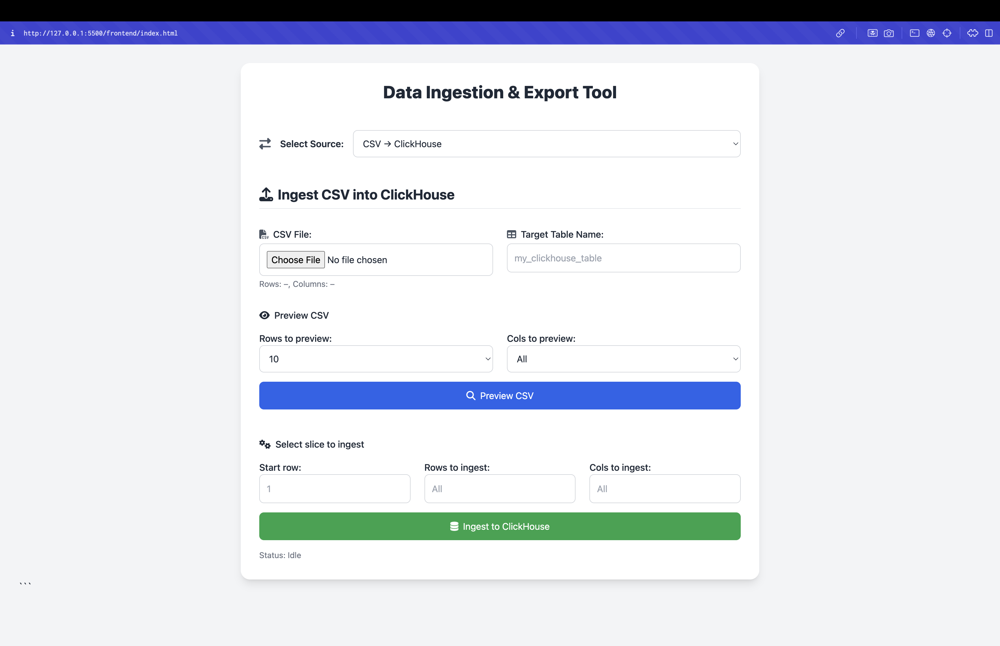
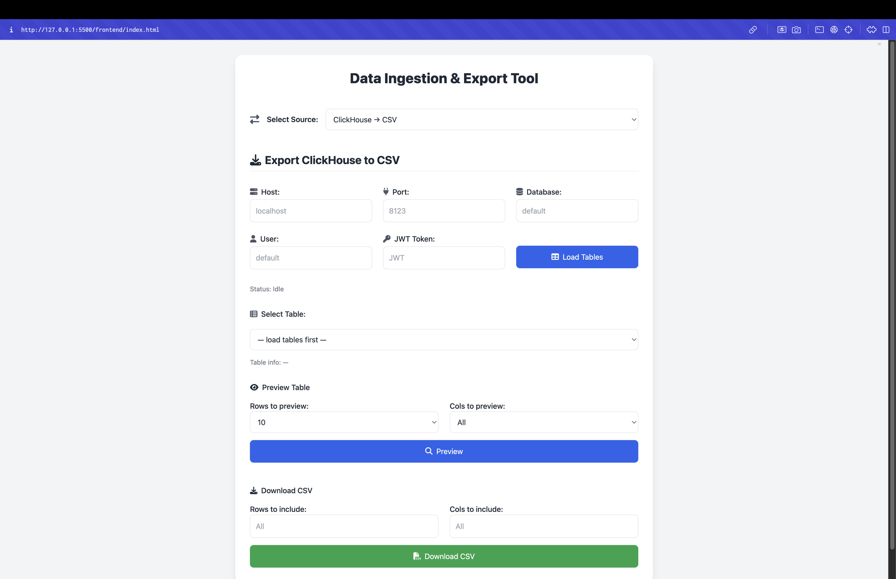

# Data Ingestion & Export Tool

A simple web-based application for:
* **Ingesting** CSV files into a ClickHouse database.
* **Exporting** ClickHouse tables to CSV files.

Both flows support previewing data slices (rows/columns) before executing the full operation.

## Table of Contents
1. [Features](#features)
2. [Prerequisites](#prerequisites)
3. [Project Structure](#project-structure)
4. [Environment Setup](#environment-setup)
5. [Installation](#installation)
6. [Running the Server](#running-the-server)
7. [Front-End UI](#front-end-ui)
8. [API Endpoints](#api-endpoints)
9. [Usage](#usage)
10. [Contributing](#contributing)
11. [License](#license)

## Images




## Features

* **CSV → ClickHouse**
   * Upload any CSV file.
   * Preview first N rows and M columns.
   * Slice the file by start row, number of rows, and number of columns.
   * Ingest selected slice into a new or existing ClickHouse table.

* **ClickHouse → CSV**
   * Configure ClickHouse connection (host/port/db/user/token).
   * List and select tables from the database.
   * Preview first N rows and M columns of any table.
   * Download the selection as a CSV file with headers.

All user inputs are validated, and real-time status messages guide you through each step.

## Prerequisites

* Node.js (v14+)
* npm or yarn
* A running ClickHouse server (local Docker recommended)

## Project Structure

```
project-root/
├─ backend/                # Express server & API routes
│  ├─ Routes/
│  │  ├─ ingestCsvRoute.js
│  │  └─ clickhouseExportRoute.js
│  ├─ Services/
│  │  └─ ingest-csv.js     # CSV header parsing & CH ingestion logic
│  └─ .env                 # ClickHouse connection settings
├─ frontend/               # Static HTML pages + JS
│  └─ index.html           # Single-page UI for both flows
├─ .gitignore
├─ package.json
└─ README.md
```

## Environment Setup

1. Copy the example env file:

```bash
cp backend/Services/.env.example backend/Services/.env
```

2. Edit `backend/Services/.env` with your ClickHouse parameters:

```
CLICKHOUSE_URL=localhost
CLICKHOUSE_PORT=8123
CLICKHOUSE_USER=default
CLICKHOUSE_TOKEN=           # leave blank if none
CLICKHOUSE_DB=default
```

## Installation

From the project root:

```bash
npm install    # or yarn install
```

## Running the Server

```bash
npm run dev    # starts backend at http://localhost:3000
```

By default, the API mounts under `/api/source-csv` and serves the static `frontend/index.html`.

## Front-End UI

Open your browser to `http://localhost:3000/` to access the single-page UI. Use the **Source** dropdown to switch between:
* **CSV → ClickHouse** ingestion flow
* **ClickHouse → CSV** export flow

All interactions (preview, ingest, export) happen without reloading the page.

## API Endpoints

| Method | Path | Description |
|--------|------|-------------|
| POST | `/api/source-csv/ingest` | Upload & ingest CSV into ClickHouse |
| GET | `/api/source-csv/tables` | List tables in ClickHouse |
| GET | `/api/source-csv/info/:table` | Get row & column counts for a table |
| GET | `/api/source-csv/export/:table/preview` | Preview first N rows & M columns |
| GET | `/api/source-csv/export/:table` | Download CSV (with optional limits) |

## Usage

1. **Ingest CSV**
   * Select **CSV → ClickHouse**.
   * Upload or choose your CSV file.
   * Preview any slice of it.
   * Specify the ClickHouse table name.
   * Choose row/column slice to ingest.
   * Click **Ingest** and monitor status.

2. **Export CSV**
   * Select **ClickHouse → CSV**.
   * Enter your ClickHouse connection details.
   * Click **Load Tables** and choose a table.
   * Preview slice of the table.
   * Set export row/column limits.
   * Click **Download CSV**.

## Contributing

1. Fork this repository
2. Create a new branch (`git checkout -b feature/YourFeature`)
3. Commit your changes (`git commit -m 'Add feature'`)
4. Push to the branch (`git push origin feature/YourFeature`)
5. Open a Pull Request

## License

This project is licensed under the MIT License.

